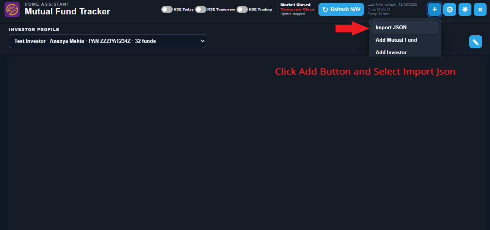
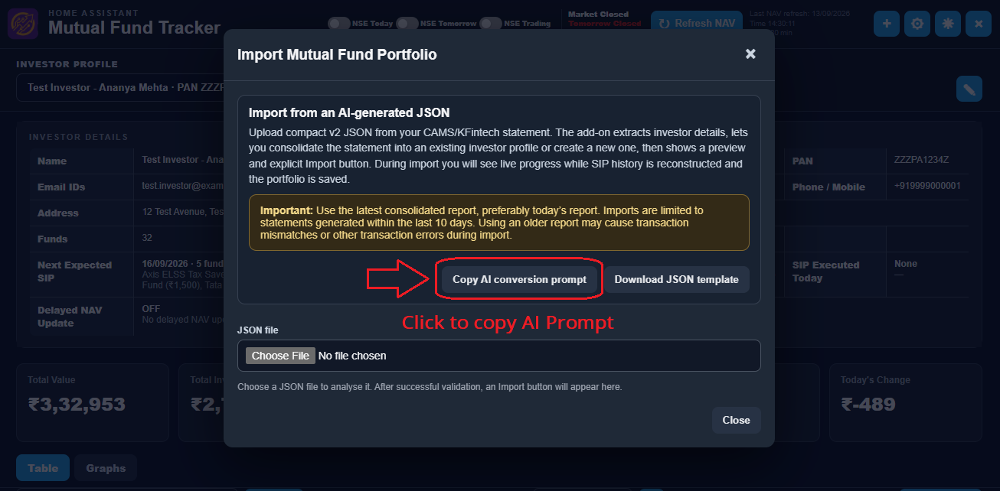
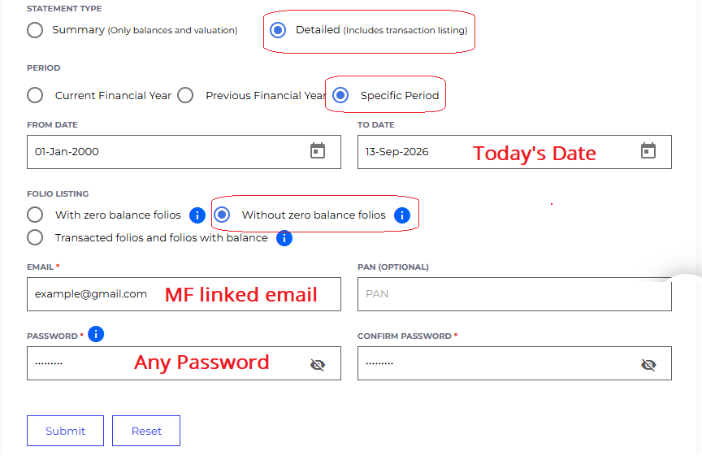
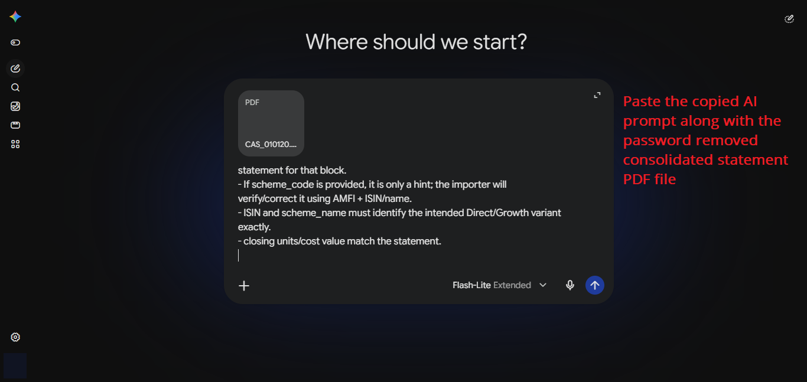

# Mutual Fund Tracker

**Indian mutual-fund portfolio tracking for Home Assistant.**

Mutual Fund Tracker combines a Home Assistant app with a dedicated Home Assistant integration. It tracks Indian mutual-fund holdings, SIPs, transactions, AMFI-based NAVs, returns and XIRR, and exposes the results to Home Assistant.

> **India only.** The project is designed for Indian mutual funds, CAMS/KFintech statements, AMFI NAV data, NSE trading-day information and Asia/Kolkata (IST).

**Current stable release: v1.0.0**

---

## What is included?

| Component | Purpose | Where it is installed |
|---|---|---|
| **Mutual Fund Tracker app** | Database, NAV refresh, SIP processing, statement import, web UI and REST API | Home Assistant **Settings → Apps** |
| **Mutual Fund Tracker integration** | Home Assistant sensors, status entities, refresh/export controls | **HACS** |
| **Mutual Fund Tracker card** | Lovelace dashboard card for portfolio/fund information | Included with the integration |

### Important: the app and integration are separate

**Install the app first.** The app does the portfolio/NAV/SIP work. The Home Assistant integration reads the app's exported state and exposes it to Home Assistant. Installing the integration alone does not run the tracker.

---

## Features

- Multiple investor profiles and multiple funds per investor
- SIP schedules and historical transactions
- Latest and historical NAV handling using AMFI data
- Daily, monthly and yearly returns
- Portfolio XIRR
- Recent SIP reconciliation during statement import
- Delayed-NAV SIP handling
- NSE today/tomorrow/trading-day status
- NIFTY 50 status in the app
- Light/dark web UI
- Custom Lovelace dashboard card
- PNG portfolio export
- Home Assistant entities for portfolio values, returns, SIP status and NAV refresh status

---

# Installation

There are **two installations**. Follow both sections below if you want the full Home Assistant experience.

## 1. Install the Mutual Fund Tracker app in Home Assistant

The app is installed from the Home Assistant App Store using this GitHub repository:

```text
https://github.com/sheminasalam/mutual-fund-tracker
```

### Step-by-step

1. In Home Assistant, open **Settings → Apps**.
2. Select **Install app**.
3. Open the **⋮** menu in the top-right corner.
4. Select **Repositories**.
5. Paste:

   ```text
   https://github.com/sheminasalam/mutual-fund-tracker
   ```

6. Select **Add**.
7. Find **Mutual Fund Tracker** in the new repository.
8. Select **Install**.
9. After installation finishes, select **Start**.
10. Open the app's **Web UI**.

Home Assistant app repositories are identified by a root `repository.yaml` file; this repository includes one. Home Assistant's current documentation uses **Settings → Apps → Install app → ⋮ → Repositories** for adding third-party app repositories. citeturn721807search0turn721807search1

### What should happen

After the app starts, its web interface should be available from the app's Web UI. The app stores its persistent database/state in its own Home Assistant app data area.

> **Do not install the app from HACS.** The app is a Home Assistant app repository item, not a HACS integration.

---

## 2. Install the Home Assistant integration with HACS

The integration is located at:

```text
custom_components/mutual_fund_tracker/
```

### HACS: first-time installation

1. Make sure **HACS is already installed and configured** in Home Assistant.
2. Open **HACS → Integrations**.
3. Open the **⋮** menu.
4. Select **Custom repositories**.
5. Enter:

   ```text
   https://github.com/sheminasalam/mutual-fund-tracker
   ```

6. Set the repository type/category to **Integration**.
7. Add the repository.
8. Search HACS for **Mutual Fund Tracker**.
9. Open it and select **Download/Install**.
10. Restart Home Assistant.
11. Go to **Settings → Devices & services**.
12. Select **+ Add integration**.
13. Search for **Mutual Fund Tracker**.
14. Complete the integration setup.

HACS requires public GitHub repositories to have a README and a root `hacs.json`; when releases are used, the published GitHub release tag is used as the remote version. This repository contains both. citeturn240473search0

### After installation

The integration creates Home Assistant entities for the portfolio and status information exported by the app.

> **The integration does not download NAVs from AMFI itself.** The app performs NAV and portfolio processing; the integration reads the app's exported state.

### Manual integration installation

HACS is recommended. For manual installation, copy:

```text
custom_components/mutual_fund_tracker/
```

to:

```text
/config/custom_components/mutual_fund_tracker/
```

Then restart Home Assistant and add the integration from **Settings → Devices & services → + Add integration**.

---

## 3. Add the Mutual Fund Tracker dashboard card

The repository includes the custom Lovelace card used by the project. The integration exposes the necessary Home Assistant-side data for the card.

After installing the app and integration, follow the dashboard/card instructions in the integration documentation:

[Home Assistant integration guide](custom_components/mutual_fund_tracker/README.md)

---

# Importing your mutual-fund statement

The importer is intentionally conservative. Use a **fresh, detailed CAMS/KFintech consolidated statement**, preferably generated today. The statement coverage end date must be within the app's current 10-day import window.

## The complete workflow at a glance

**1. Open Import JSON** → **2. Copy the AI prompt** → **3. Generate a detailed consolidated statement** → **4. Remove the PDF password** → **5. Give the copied prompt + unlocked PDF to your AI assistant** → **6. Save the returned JSON** → **7. Import the JSON** → **8. Review the preview/warnings** → **9. Confirm the import**

---

## Step 1 — Open Import JSON

In the Mutual Fund Tracker web app:

1. Select the **+** button in the header.
2. Select **Import JSON**.



---

## Step 2 — Copy the exact AI conversion prompt

In the Import window, select **Copy AI conversion prompt**.

Use this exact prompt with your AI assistant. Do not rewrite it unless you understand the schema and importer requirements.



The prompt is also stored in the repository here:

[AI import prompt](mutual-fund-tracker-src/AI_IMPORT_PROMPT.md)

---

## Step 3 — Generate a consolidated CAMS/KFintech statement

Use the consolidated statement service and request a **Detailed** statement covering a **Specific Period**.

Recommended settings:

| Setting | Value |
|---|---|
| **Statement type** | **Detailed** |
| **Period** | **Specific Period** |
| **From date** | **01-Jan-2000** |
| **To date** | **Today's date** |
| **Folio listing** | **Without zero balance folios** |
| **Email** | Email linked to your mutual-fund account |
| **PAN** | Optional, where supported |
| **Password** | Any password chosen/required by the statement provider |



### Important password rule

The statement password is only needed to generate/download the statement. **Do not send the CAMS/KFintech password to your AI assistant.**

Before uploading the statement to an AI assistant:

1. Download the statement.
2. Remove/unlock the PDF password locally.
3. Keep the original password private.
4. Upload only the unlocked PDF.

---

## Step 4 — Give the prompt and unlocked PDF to your AI assistant

Start a new AI conversation, paste the copied Mutual Fund Tracker prompt, and upload the password-removed consolidated statement PDF.



Let the AI read the **complete statement** before asking it for the final JSON. Do not stop after the first few pages.

The AI is being used to **interpret the statement and format the data**. It should not invent missing transactions, alter financial values, or calculate current NAVs.

---

## Step 5 — Save the generated JSON

Ask the AI to return the compact JSON required by Mutual Fund Tracker.

Save it as a file with a `.json` extension, for example:

```text
noohu_13-09-2026.json
```

The file should contain valid JSON only. Do not save the AI's Markdown explanation or code fences around the JSON.

The schema is available here:

[IMPORT_SCHEMA.json](mutual-fund-tracker-src/IMPORT_SCHEMA.json)

---

## Step 6 — Import the JSON into Mutual Fund Tracker

1. Return to **Import JSON** in the app.
2. Choose the generated `.json` file.
3. Wait for validation to finish.
4. Review all warnings and the preview.
5. Confirm the correct investor/profile.
6. Review any SIP reconciliation decisions.
7. Confirm the import only when the preview is correct.

Treat AI-generated JSON as **untrusted input**. The application validates it before writing the portfolio to its database.

For detailed import behavior, see the [complete application guide](mutual-fund-tracker-src/README.md).

---

# What Home Assistant entities are provided?

The integration exposes portfolio sensors including:

- Total Value
- Total Invested
- Total Profit and Total Profit %
- Daily Change
- Monthly Change
- Yearly Change
- Portfolio XIRR
- Fund Count

Status and control entities include:

- NSE Today
- NSE Tomorrow
- NSE Trading
- NSE Yesterday Status
- NAV Refresh Error
- SIP Executed Today
- Delayed NAV Update
- Refresh NAV
- Export Portfolio PNG

---

# Troubleshooting

## The app does not appear after adding the repository

Check that the repository was added under **Settings → Apps → Install app → ⋮ → Repositories**, not under HACS. Refresh the browser if needed and check the Home Assistant Supervisor logs if the repository is rejected. Home Assistant documents invalid repository configuration as a common reason a third-party app repository does not appear. citeturn721807search1

## The integration does not appear in HACS

Make sure HACS is installed and configured, then add the GitHub repository as a **Custom repository → Integration**. The repository must be public and contain the required root `hacs.json` and README. citeturn240473search0

## The integration installs but shows no/old data

First check that the **Mutual Fund Tracker app is running** and that its web UI is accessible. The integration consumes the app's exported state; it does not independently fetch NAV data.

## The app works but the integration is missing

Restart Home Assistant after installing the integration, then go to **Settings → Devices & services → + Add integration** and search for **Mutual Fund Tracker**.

---

# Repository structure

The repository intentionally contains both the Home Assistant app and the HACS integration:

```text
mutual-fund-tracker/
├── custom_components/
│   └── mutual_fund_tracker/       # HACS integration
├── mutual-fund-tracker-src/       # Home Assistant app
│   ├── config.yaml
│   ├── Dockerfile
│   └── run.sh
├── .github/
├── hacs.json                      # HACS repository metadata
├── repository.yaml                 # Home Assistant app repository metadata
├── LICENSE
└── README.md
```

This lets the same GitHub repository serve both the Home Assistant app repository and the HACS integration repository. Home Assistant requires `repository.yaml` at the root for an app repository, while HACS requires its repository metadata at the root and the integration in the expected `custom_components/<domain>/` location. citeturn721807search0turn240473search0

---

# Updating

The stable release line starts at **v1.0.0**.

Future releases should use semantic versioning:

```text
1.0.1   bug fix
1.0.2   bug fix
1.1.0   backward-compatible feature release
2.0.0   breaking change
```

When publishing through GitHub Releases, use the same release version in the app and integration metadata. HACS uses the published GitHub release tag as the remote version when releases are present. citeturn240473search0

---

# Documentation

- [Complete application guide](mutual-fund-tracker-src/README.md)
- [Application documentation](mutual-fund-tracker-src/DOCS.md)
- [AI import prompt](mutual-fund-tracker-src/AI_IMPORT_PROMPT.md)
- [Import schema](mutual-fund-tracker-src/IMPORT_SCHEMA.json)
- [Home Assistant integration guide](custom_components/mutual_fund_tracker/README.md)
- [Changelog](mutual-fund-tracker-src/CHANGELOG.md)

---

# Support and security

Please report bugs and feature requests through [GitHub Issues](https://github.com/sheminasalam/mutual-fund-tracker/issues).

When reporting an issue, include:

- Mutual Fund Tracker version
- Home Assistant version
- Relevant logs
- Steps to reproduce the problem

**Never include CAMS/KFintech passwords, PAN details, account numbers, bank information, or private statement PDFs in public issues.**

---

# License

MIT License. See [LICENSE](LICENSE).
