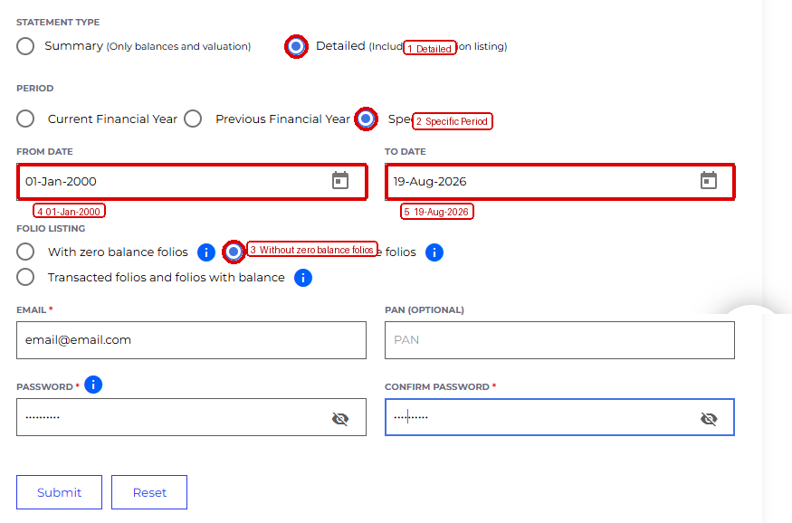

**Mutual Fund Tracker**

**User Guide and Import Procedure**

*Stable release: v1.0.0*

| **INDIA ONLY:** Mutual Fund Tracker is designed specifically for Indian mutual funds and the Indian market. It uses Indian mutual-fund data, Indian NAVs, SIP conventions, CAMS/KFintech consolidated statements, NSE trading-day/holiday information, Asia/Kolkata (IST), and the NIFTY 50. It is not designed for funds, markets, currencies, tax rules, or statements from other countries. |
|------------------------------------------------------------------------------------------------------------------------------------------------------------------------------------------------------------------------------------------------------------------------------------------------------------------------------------------------------------------------------------------------|

**Purpose.** Use this guide to obtain a recent CAMS/KFintech
consolidated statement, convert it to the tracker's compact JSON with an
AI assistant, and import it safely into Mutual Fund Tracker.

# 1. What the app does

Mutual Fund Tracker is a Home Assistant add-on and web application for
maintaining an investment portfolio from mutual-fund transaction
history. It stores investor profiles, fund holdings, transactions, SIP
schedules, NAV history, and portfolio calculations in its own database,
then exposes selected portfolio and status information to Home
Assistant.

> **1.** Maintain multiple investor profiles and multiple funds per
> investor.
>
> **2.** Track SIPs, historical transactions, units, invested value,
> current value, profit, day/month changes, and portfolio XIRR.
>
> **3.** Refresh NAV data manually or on the configured automatic
> schedule.
>
> **4.** Import a consolidated CAMS/KFintech statement through the
> compact JSON workflow described below.
>
> **5.** Reconcile recent SIP activity during import instead of silently
> guessing whether a missing SIP was executed or skipped.
>
> **6.** Expose portfolio and NSE status entities to Home Assistant for
> automations.
>
> **7.** Provide a responsive web UI with light/dark mode, fund editing,
> transactions, exports, and portfolio summaries.

# 2. Recommended import workflow

| **IMPORTANT:** Use the latest consolidated statement available, preferably generated today. The current importer is intentionally limited to statements from the last 10 days. The 10-day check is based on the statement coverage end date (the To Date), not the date you downloaded or uploaded the PDF. |
|-------------------------------------------------------------------------------------------------------------------------------------------------------------------------------------------------------------------------------------------------------------------------------------------------------------|

> **1.** Get a fresh detailed consolidated statement from CAMS/KFintech.
>
> **2.** Unlock the PDF locally before giving it to an external AI
> assistant. The CAMS password is not needed by Mutual Fund Tracker and
> should never be pasted into the AI conversation.
>
> **3.** Use the built-in Copy AI conversion prompt in the app, or the
> current project prompt you keep for converting statements to the
> tracker JSON.
>
> **4.** Upload the unlocked statement PDF to the AI together with the
> copied conversion prompt.
>
> **5.** Ask the AI to return the compact v2 JSON only after it has
> parsed the complete statement. Do not ask it to change financial
> values or invent missing transactions.
>
> **6.** Save the returned JSON as a .json file on your computer.
>
> **7.** Open Mutual Fund Tracker, choose Import JSON, select the saved
> JSON file, review the import preview and warnings, resolve
> investor/SIP choices, then explicitly confirm the import.

# 3. How to obtain the consolidated statement

Use the CAMS Consolidated Account Statement page: [<u>CAMS –
Consolidated Account
Statement</u>](https://www.camsonline.com/Investors/Statements/Consolidated-Account-Statement)

The following settings are the recommended form values for a full
detailed statement. The screenshot below is annotated to make the
selected options easy to identify.

*Recommended CAMS statement request. Red circles/boxes identify the
options to select.*

| **Field**      | **Select / enter**                     | **Why**                                                                              |
|----------------|----------------------------------------|--------------------------------------------------------------------------------------|
| Statement Type | Detailed                               | Includes transaction listing, not only valuation.                                    |
| Period         | Specific Period                        | Lets you use a full-history start date and a current end date.                       |
| From Date      | 01-Jan-2000                            | Use the full-history start date shown in the recommended workflow.                   |
| To Date        | Today's date                           | Use the date on which you generate the statement. In this example: 19-Aug-2026.      |
| Folio Listing  | Without zero balance folios            | Keeps the statement focused on relevant holdings.                                    |
| Email / PAN    | Your own statement credentials/details | Use the details required by CAMS for your account.                                   |
| Password       | Any password used by CAMS              | Only for downloading. Unlock/remove the PDF password before giving the PDF to an AI. |

| **PASSWORD SAFETY:** The app does not need your CAMS password. Never put the CAMS password into the AI conversion prompt. Unlock the PDF first, then upload only the unlocked PDF. |
|------------------------------------------------------------------------------------------------------------------------------------------------------------------------------------|

# 4. Convert the PDF to the tracker JSON

> **1.** In Mutual Fund Tracker, open the Import JSON window.
>
> **2.** Use Copy AI conversion prompt to copy the current conversion
> instructions.
>
> **3.** Open your preferred AI assistant.
>
> **4.** Paste the copied conversion prompt into the AI conversation.
>
> **5.** Upload the password-removed CAMS/KFintech PDF.
>
> **6.** Ask the AI to follow the supplied schema and return the compact
> v2 JSON used by Mutual Fund Tracker.
>
> **7.** Wait for the AI to finish reading the complete statement. Do
> not stop after the first few pages.
>
> **8.** Prefer the downloadable JSON file attached by the AI. The prompt
> asks the AI to create a file named from the investor, for example
> `Noohu_Konnu_Abdul_Salam.json`. Download that file directly.
>
> **9.** If the AI platform cannot create a downloadable file, copy its
> final JSON response into a plain-text file and save it with a `.json`
> extension using the investor name. Do not save a screenshot, Markdown
> code block, or prose as the JSON file. The file should contain valid JSON only.

| **AI RESPONSIBILITY:** The AI is being used to interpret the statement and produce the compact JSON. It should not be asked to calculate current NAVs, modify transaction values, or invent transactions. Mutual Fund Tracker remains responsible for validation, NAV handling, SIP reconciliation, merging, and database updates. |
|------------------------------------------------------------------------------------------------------------------------------------------------------------------------------------------------------------------------------------------------------------------------------------------------------------------------------------|

| **UNTRUSTED INPUT:** The JSON is an input document, not a trusted database export. Mutual Fund Tracker validates and previews it before writing to the database. Always review warnings and the investor/fund/SIP decisions before confirming. |
|------------------------------------------------------------------------------------------------------------------------------------------------------------------------------------------------------------------------------------------------|

## What the AI should return

The AI is used to interpret the CAMS/KFintech PDF and produce the compact import JSON. It should **not** invent transactions, change financial values, estimate missing amounts, or decide whether an unresolved recent SIP was executed. Mutual Fund Tracker performs validation, NAV handling, investor matching, merge logic, and recent-SIP reconciliation itself.

Treat the generated JSON as untrusted input and review the import preview before confirming.

# Illustrated import guide

The safest way to populate or update a portfolio is to use a **fresh detailed consolidated statement**, convert it to the tracker's compact JSON with the supplied AI prompt, and import the JSON after reviewing the preview.

### Step 1 — Open Import JSON

From the app header, open the **+** menu and choose **Import JSON**.

### Step 2 — Copy the AI conversion prompt

In the Import window, click **Copy AI conversion prompt**. This copies the exact conversion instructions expected by the current importer.

### Step 3 — Generate the consolidated statement

Use the CAMS/KFintech consolidated statement service. For a full-history import, use:

- **Detailed** statement type
- **Specific Period**
- **From:** `01-Jan-2000`
- **To:** today's date
- **Folio listing:** without zero-balance folios

The email used must be associated with your mutual-fund statements. The PDF password is only for downloading the statement; **remove the password before giving the PDF to an AI assistant**.

### Step 4 — Give the prompt and unlocked PDF to your AI assistant

Paste the copied prompt into your AI assistant and upload the **password-removed** consolidated statement PDF. Ask the AI to return the compact v2 JSON requested by the prompt. Wait until the assistant has finished reading the complete statement.

### Step 5 — Save and import the JSON

Prefer the AI platform's downloadable JSON file when available. Otherwise save the final JSON response as plain text with a `.json` extension. Return to **Import JSON**, choose the file, review all warnings and SIP decisions, and then confirm the import.

> **Important:** Never give CAMS/KFintech account passwords to the AI assistant. The AI is only being used to interpret the unlocked statement and produce structured JSON. Mutual Fund Tracker remains responsible for validation, NAV handling, reconciliation, calculations and database updates.

# 5. Import the JSON into Mutual Fund Tracker

> **1.** Open the + menu in the app header and choose Import JSON.
>
> **2.** Choose the saved .json file.
>
> **3.** Read the import warnings before proceeding. Warnings about unit
> mismatches, old SIP activity, or incomplete statement history should
> not be ignored.
>
> **4.** Confirm investor identity. PAN is the primary identity key in
> the import flow. If the statement matches an existing investor, choose
> the existing profile/merge path rather than creating an unnecessary
> duplicate.
>
> **5.** Review SIP activity confirmation. If you have deliberately
> stopped a SIP, select Stopped / inactive. That explicit choice takes
> precedence over an old active-looking SIP schedule.
>
> **6.** Review Recent SIP reconciliation. An active SIP whose
> applicable NAV is already the latest NAV for that specific fund can be
> handled automatically. An active SIP whose applicable NAV is behind
> the latest NAV is presented for an explicit Executed or Skipped
> decision.
>
> **7.** When the preview is correct, use the explicit Import / Confirm
> action. Do not close the window during the save/progress stages.
>
> **8.** After the import finishes, verify the investor fund count,
> total invested value, current total value, and any recently reconciled
> SIPs.

| **STOPPED SIP RULE:** If you have already stopped a SIP, select Stopped / inactive. A stopped SIP must not be auto-executed simply because the latest NAV is current. |
|-----------------------------------------------------------------------------------------------------------------------------------------------------------------------|

# 6. Importing a second statement for the same investor

A normal use case is to import a second consolidated statement that
contains additional funds for the same investor. The importer recognizes
the investor using the statement identity information and merges
holdings without creating a second investor for the same identity.

> **1.** Use the same investor/PAN identity when the statement belongs
> to an existing investor.
>
> **2.** Review the fund list and transaction totals after the merge.
>
> **3.** Do not manually combine duplicate-looking funds before import.
> The importer uses investor, folio, scheme and fund identity
> information to preserve the correct holding structure.
>
> **4.** If the second statement contains a different folio or an
> additional holding of the same scheme, allow the importer to preserve
> the folio/holding distinction rather than manually forcing two
> holdings into one record.
>
> **5.** After import, verify that the web UI totals and the Home
> Assistant integration totals agree.

# 7. SIP reconciliation during import

The importer distinguishes ordinary historical statement reconstruction
from a current/live SIP event. This distinction matters because the Home
Assistant SIP Executed Today status is meant to represent current live
executions, not arbitrary historical transactions reconstructed from an
old statement.

| **Situation**                                             | **What the importer does**                                              | **SIP Executed Today**                                             |
|-----------------------------------------------------------|-------------------------------------------------------------------------|--------------------------------------------------------------------|
| Active SIP + applicable NAV is latest NAV for that fund   | May be recorded automatically as the current/latest SIP during import.  | Current/live status record is created.                             |
| Active SIP + applicable NAV is older than latest NAV      | Ask whether the SIP was Executed or Skipped.                            | Historical reconciliation does not masquerade as a live execution. |
| SIP explicitly marked Stopped / inactive                  | Do not create or auto-execute the missing SIP.                          | No live execution record.                                          |
| Older historical SIP already represented in the statement | Import the transaction history; do not recreate a live execution event. | No live execution record.                                          |

| **NAV COMPARISON:** The latest-NAV test is fund-specific. The importer compares the SIP's applicable NAV with that fund's latest available NAV, not simply a global latest NAV date. |
|--------------------------------------------------------------------------------------------------------------------------------------------------------------------------------------|

# 8. Adding a new mutual fund manually

Use the + menu and choose Add Mutual Fund. The fund lookup can search by
fund name or scheme code.

## SIP method

> **1.** Select the fund and choose SIP.
>
> **2.** Enter the SIP history/date and amount information requested by
> the form.
>
> **3.** Use Get NAV & Preview. The app obtains the required NAV data
> for the selected fund and calculates the missing values.
>
> **4.** Review the preview carefully. Nothing is written until the
> explicit confirmation step.
>
> **5.** Confirm & Add Fund. The app refreshes the newly added fund
> only, rather than refreshing every fund in the portfolio.

## Lumpsum method

> **1.** Select the fund and choose Lumpsum.
>
> **2.** Enter the NAV date (not the transaction date) for each
> historical investment.
>
> **3.** For each row, provide either the amount invested or the units
> purchased. The app calculates the missing value using the NAV;
> intentionally conflicting amount/unit values should not be entered.
>
> **4.** Use Get NAV & Preview and review the calculated NAV, amount,
> and units.
>
> **5.** Confirm & Add Fund. The app records the transactions and
> refreshes the new fund only.

| **PERFORMANCE:** The post-add workflow is intentionally scoped to the new fund for speed. The normal manual Refresh NAV button and automatic NAV scheduler continue to refresh the full portfolio. |
|----------------------------------------------------------------------------------------------------------------------------------------------------------------------------------------------------|

# 9. Editing a fund and recording transactions

The fund table uses a single Edit button. The fund editor contains three
tabs:

- Edit SIP — change SIP amount/day and related SIP settings.

- Transact — enter a purchase or sell transaction, fetch NAV, and
  preview the calculation before recording it.

- Transactions — review the transaction history for the fund.

The editor uses responsive scrolling. On mobile, Edit SIP and Transact
scroll with the modal content; the Transactions tab keeps the
transaction table as its own dedicated scrolling area.

# 10. NAV refresh and NIFTY 50

- Refresh NAV updates the portfolio NAV data according to the configured
  NAV refresh window.

- The normal NAV refresh and automatic scheduler operate on the full
  portfolio.

- NIFTY 50 is an internal app/card value, not a separate Home Assistant
  NIFTY sensor.

- NIFTY 50 uses Yahoo Finance as the primary live source and the configured published Google Sheets CSV as fallback
  and displays the index plus daily point change; positive changes are
  green and negative changes are red.

- The NIFTY update interval is configurable in Settings and can be
  switched off.

- NIFTY updates run only during the application market window of
  09:00–15:30 Asia/Kolkata. When the market is closed, the status shows
  Update stopped.

- NSE and market status are independent of NIFTY availability. A NIFTY
  feed failure does not define whether the market is open.

# 11. App UI and settings

- Dark mode can be toggled from the top-right theme icon. The preference
  is kept in the browser.

- Settings contains the NAV refresh interval and NIFTY update interval
  controls.

- The + menu provides Import JSON and Add Mutual Fund.

- Investor selection is sorted by the order investors were added, oldest
  first.

- Fund names in the fund table are wrapped at the scheme/plan boundary
  to reduce unnecessary horizontal scrolling.

- Displayed dates use DD/MM/YYYY in the UI; API and database date values
  remain machine-readable ISO dates.

- The portfolio view has **Table** and **Graphs** tabs. The Table tab supports
fund-name search, SIP-status and total-return filters, plan/option filters
(Direct/Regular and Growth/IDCW), and a single-select Scheme Category filter
populated from the latest MFAPI metadata for funds actually held by the investor.
The numeric **Parameter / Relationship / Value** filter can be combined with
these filters (for example, **XIRR > 10**). The Graphs tab provides historical
line charts. You can select multiple funds, select one or more parameters
(Total Value, Total Invested, Day Change, or Profit %), and choose 1 Month,
30 Days, 3 Months, 6 Months, 1 Year, or Inception. Historical NAV data is
cached locally and only missing ranges are fetched; historical portfolio
snapshots are derived from the transaction ledger so graph calculations use
the same investment semantics as the app.

- The Export PNG action saves the currently displayed portfolio as an
  image. The app does not currently provide a dedicated Export PDF
  action.

# 12. Home Assistant integration

The Mutual Fund Tracker device exposes portfolio sensors and status
entities for automation. The integration is separate from the web UI
presentation and should be checked independently when validating
automations.

| **Entity / function** | **Meaning**                                                                             | **Notes**                                          |
|-----------------------|-----------------------------------------------------------------------------------------|----------------------------------------------------|
| NSE Today Status      | Whether today is an NSE trading day.                                                    | Not the same as current market-open status.        |
| NSE Trading Status    | Whether the application market window is currently open.                                | Uses 09:00–15:30 Asia/Kolkata.                     |
| NSE Yesterday Status  | Whether the previous day was an NSE trading day.                                        | Useful for automations.                            |
| NAV Refresh Error     | Whether the most recent full NAV refresh encountered an error.                          | Review the app log / refresh result if on.         |
| SIP Executed Today    | Whether a current live SIP execution record exists for today for the relevant investor. | Historical import reconciliation is kept separate. |
| Refresh NAV           | Home Assistant control to trigger a NAV refresh.                                        | Full portfolio refresh.                            |

| **ENTITY IDS:** Exact Home Assistant entity IDs can change across installations or registrations. Before using an entity in an automation, confirm the current entity ID in Home Assistant Developer Tools → Entities. |
|------------------------------------------------------------------------------------------------------------------------------------------------------------------------------------------------------------------------|

# 13. Custom Lovelace card

The project includes a **Mutual Fund Tracker** custom Lovelace card for Home Assistant. It is the recommended dashboard view of the portfolio data exposed by the Mutual Fund Tracker integration.

### What the card shows

- Investor selection and fund count.
- Total Value and Total Invested.
- Total Profit and profit percentage.
- Portfolio XIRR.
- Today's Change.
- Next Expected SIP and SIP Executed Today.
- NSE Today Status and current market/trading status.
- NIFTY 50 index and daily point change, with green for positive movement and red for negative movement.
- Fund-level SIP information, day/month returns, current value, invested amount, profit, profit percentage, and XIRR.

### Calculations shown by the application and card

The tracker calculates portfolio and fund metrics from stored transactions and NAV history, including current value, invested value, profit, profit percentage, day change, day percentage, month change, month percentage, year return, and XIRR. SIP schedules, next expected SIP information, and live SIP execution status are tracked separately from historical transaction reconstruction.

### Card installation

After the Mutual Fund Tracker app and Home Assistant integration are installed, add the **Mutual Fund Tracker** custom Lovelace card to a dashboard. The integration exposes the entities the card consumes; the card itself does not access the application's database or perform portfolio calculations.

### NIFTY 50 and market status

The card uses the app/integration's existing NSE and market status data. NIFTY 50 uses Yahoo Finance as the primary live source and the configured published Google Sheets CSV as fallback and is updated according to the NIFTY interval configured in the app while the market window is open (09:00–15:30 Asia/Kolkata). NIFTY is an internal app/card value rather than a separate Home Assistant NIFTY sensor.

### Dark mode

The main app has a persistent light/dark theme toggle in its header. The Lovelace card is designed to work with Home Assistant's dashboard theme; the app's local theme preference and the card's Home Assistant theme are separate settings.

# 14. Important warnings and good practices

- This application is designed for Indian mutual funds and the Indian
  market only.

- Always prefer the latest consolidated statement, preferably generated
  today, and keep the statement coverage end date within the current
  10-day limit.

- Remove the PDF password before giving a statement to an external AI
  assistant. Do not include financial-statement passwords in prompts.

- Treat AI-generated JSON as untrusted input and review the importer
  preview before confirming.

- If you have intentionally stopped a SIP, explicitly mark it Stopped /
  inactive during import. Do not let an old JSON schedule cause it to be
  treated as active.

- Do not delete the database merely to upgrade the add-on. New tables or
  state records are designed to be created alongside the existing
  database.

- After importing or merging statements, compare web UI totals with the
  Home Assistant integration totals.

- Keep a backup/export before major data changes or large imports.

# 15. Exporting the portfolio

Use the Export PNG button above the fund table to save the currently
displayed portfolio as a PNG image. The export follows the selected
investor and is intended for sharing or keeping a visual snapshot of the
portfolio.

The current app does not provide an Export PDF function. If you need a
PDF copy, use the browser or operating system print function as a
separate step; the app itself currently exports PNG, not PDF.

# 16. Quick troubleshooting

| **Symptom**                                   | **First checks**                                                                                                                                                                               |
|-----------------------------------------------|------------------------------------------------------------------------------------------------------------------------------------------------------------------------------------------------|
| Import says the statement is too old          | Generate a new consolidated statement. The importer checks the statement To Date against the current date and enforces the 10-day window.                                                      |
| Import asks about SIP activity                | Review the last transaction date and explicitly choose the current SIP state. If you stopped it, select Stopped / inactive.                                                                    |
| Import reports a unit mismatch warning        | Review the warning, check whether the statement includes switches/redemptions or incomplete history, and do not ignore a large mismatch.                                                       |
| Home Assistant total differs from the web app | First verify that the web UI has the correct values. Then allow the integration to refresh and compare the investor/fund count and integration values. Do not immediately delete the database. |
| NIFTY shows unavailable                       | Check the configured NIFTY live sources and NIFTY update setting. Market status itself can continue working independently.                                                               |
| Card looks stale                              | First verify the underlying Home Assistant entities. The custom card depends on those integration states.                                                                                      |
| Dark-mode text or controls look wrong         | Check the current app version and browser refresh. The web UI uses its own theme preference; the custom Lovelace card has separate styling.                                                    |

> **NAV refresh:** For established holdings, the normal full-portfolio refresh downloads a single AMFI `NAVAll.txt` latest-NAV snapshot and matches it by scheme code. Historical NAV lookups used for SIP/Lumpsum/import reconciliation remain on the existing MFAPI historical endpoint.
